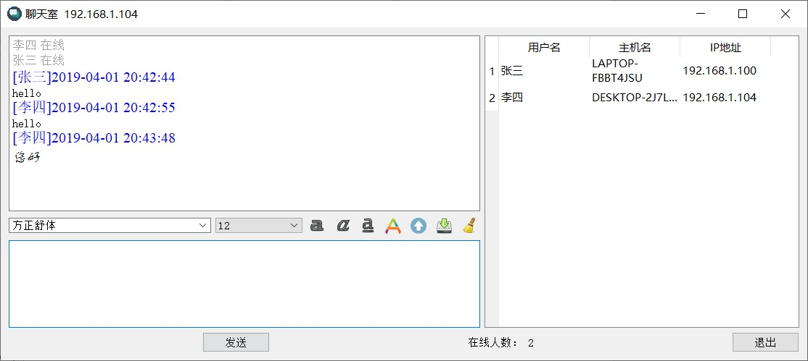
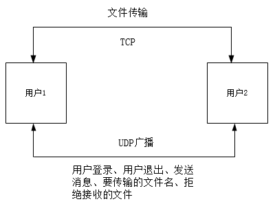
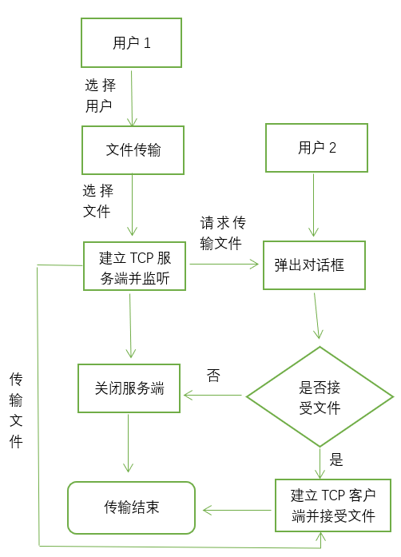

# ChatRoom
qt_局域网聊天室，修改自《Qt开发实战》中的例子

## 运行软件
 Windows：进入 <Windows版本_编译完成> 目录，点击ChatRoom.exe  
 Linux：使用Qt Creator打开ChatRoom.pro编译运行

## 依赖环境
 + Qt5.12
 + C++11

## 效果
**登录界面**
 
**聊天界面**
 

## 各模块功能

		登录模块：
			自定义标题栏
			获取用户输入的名字
			获取本机IP
			登录按钮：按下后将用户名和IP地址传送到聊天模块，并切换界面到聊天模块
		聊天界面模块：
			广播该用户已在线
			显示所有在线的用户与对应的主机名和IP
			输入框可更改字体样式，如字体种类、大小、颜色等
			发送消息的功能
			退出则向所有用户广播该用户已离线
		文件传输功能
			显示文件传输百分比与需要传输的时间

## 数据流程
**主要通过UDP与TCP协议来分别实现消息的传播和文件传输的功能**
 
**文件传输模块流程图  **
 
